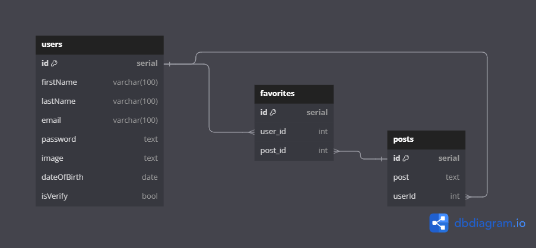

# API Documentation

## Overview

This API provides user authentication with JSON Web Tokens (JWT) and password encryption using Bcrypt. It allows users to create, view, modify, and delete their profiles, as well as create, view, modify, and delete posts. Additionally, users can mark posts as favorites.

## Technologies Used

- Node.js
- Express
- Sequelize
- Bcrypt
- JSON Web Tokens (JWT)
- PostgreSQL 

## Diagram

## Authentication
You can generate your `TOKEN_SECRET` with the Node command: 
* require('crypto').randomBytes(64).toString('hex')
